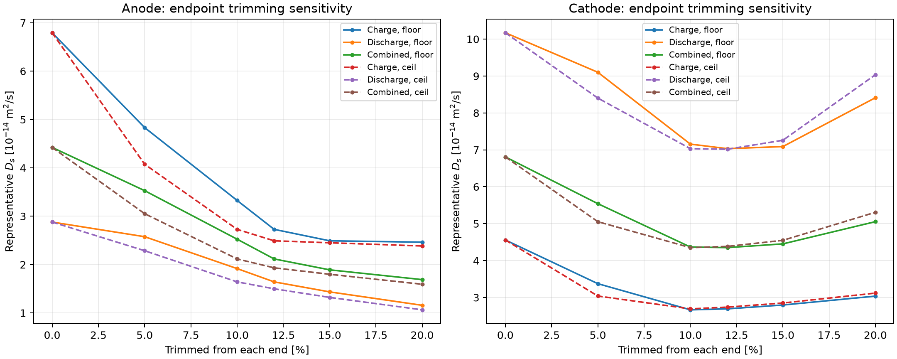
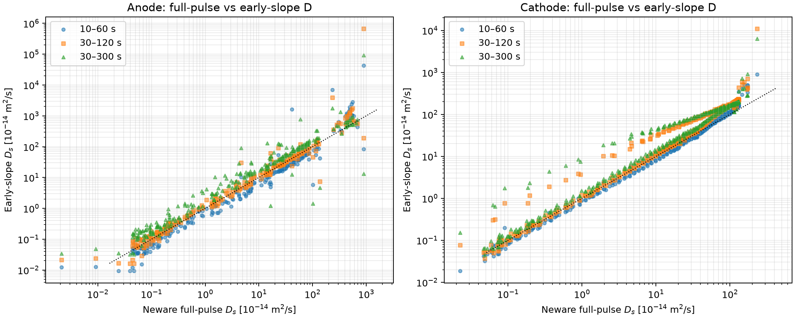

# 260927 GITT 기반 Dsn/Dsp 근거 재검증

## 결론

- 기존 `Dsn = 2.1e-14 m2/s`, `Dsp = 4.4e-14 m2/s`는 계산 오류로 생긴 값은 아니다.
- 다만 두 값은 **활물질 고유 확산계수의 독립 측정 고정값**이 아니라, 현재 Neware 식·질량·면적·600 s 펄스·endpoint 제거 규칙으로 얻은 **apparent/effective GITT 대표값**이다.
- `Dsp = 4.4e-14`는 endpoint 정수 처리에 거의 민감하지 않지만, `Dsn = 2.1e-14`는 동일 문구를 어떻게 정수 처리하느냐에 따라 `2.12`와 `2.52e-14`로 약 19% 바뀐다.
- 따라서 현재 모델에서는 두 값을 초기값/민감도 기준값으로 유지할 수 있으나, 최종적으로 고정하는 것은 권장하지 않는다. SEM 반경을 고정한 뒤 `R^2/D_s` 또는 `D_s`를 full-cell pulse fitting에서 제한된 범위로 재식별하는 편이 타당하다.

## 1. 기존 2.1/4.4의 정확한 재현 경로

각 셀·방향별 pulse D를 log 공간에서 평균하고, 세 셀을 다시 기하평균한 뒤 charge/discharge 대표값을 기하평균했다.

| 전극 | endpoint 처리 | charge | discharge | combined | 단위 |
|---|---:|---:|---:|---:|---|
| Anode | 10% `floor` (양끝 4개) | 3.325 | 1.917 | 2.525 | 1e-14 m2/s |
| Anode | 10% `ceil` (양끝 5개) | 2.728 | 1.642 | **2.117** | 1e-14 m2/s |
| Cathode | 10% `floor` (양끝 7개) | 2.666 | 7.155 | 4.367 | 1e-14 m2/s |
| Cathode | 10% `ceil` (양끝 8개) | 2.692 | 7.032 | **4.351** | 1e-14 m2/s |

슬라이드의 `2.73/1.64 -> 2.1`, `2.69/7.03 -> 4.4`는 정확히 `ceil(0.1*n)` 제거와 일치한다. 따라서 기존 값의 숨은 규칙은 “10%를 올림한 개수만큼 양끝에서 제거”이다.

## 2. endpoint 제거 민감도

| 각 끝에서 제거 | Anode combined | Cathode combined | 단위 |
|---:|---:|---:|---|
| 0% | 4.422 | 6.809 | 1e-14 m2/s |
| 5% floor | 3.528 | 5.542 | 1e-14 m2/s |
| 10% floor | 2.525 | 4.367 | 1e-14 m2/s |
| 10% ceil | 2.117 | 4.351 | 1e-14 m2/s |
| 15% floor | 1.891 | 4.452 | 1e-14 m2/s |
| 20% floor | 1.689 | 5.054 | 1e-14 m2/s |

음극은 5--20% 선택만으로 대표값이 약 2.1배 변한다. 양극은 같은 구간에서 약 1.27배이다. 따라서 음극 2.1은 endpoint 규칙에 민감한 통계적 대표값이다.

## 3. 원본 record 재구성 결과

- 600 s 정규 pulse에서 `V0`, pulse 시작 `V1`, pulse 끝 `V2`, 다음 2 h rest 끝 `V3`를 원본 record에서 재구성했다.
- 중앙 10% ceil 구간에서 Neware D와 반올림된 원본 전압으로 재계산한 D의 절대 상대오차 중앙값은 음극 charge/discharge 2.87/3.31%, 양극 charge 1.42%였다. 따라서 표의 식과 Neware D 열은 대체로 일치한다.
- 음극 `|Delta Es|` 중앙값은 약 2.0 mV, 양극은 약 7.9 mV이다. 원본 전압은 0.1 mV 단위로 저장되어 있어 음극은 전압 반올림과 rest 미수렴 오차가 제곱으로 증폭된다.
- 첨부된 cathode raw `_1.xlsx`는 약 1.186 million data point에서 끝나지만 D 요약은 약 1.324--1.343 million까지 존재한다. 음극(anode)은 각 방향의 마지막 pulse만 제외하고 재구성 가능했지만, **양극(cathode) discharge 후반 19/21/22개 pulse**는 현재 raw Excel만으로 재검증할 수 없다. 즉 positive-electrode raw export가 후반부에서 잘려 있다.

## 4. sqrt(t) 구간 의존성

중앙 10% ceil 구간에 대해 동일한 equilibrium 변화량을 사용하고 pulse 전압을 10--60 s, 30--120 s, 30--300 s에서 각각 `sqrt(t)` 회귀했다.

| 전극/방향 | 10--60 s | 30--120 s | 30--300 s | 단위 |
|---|---:|---:|---:|---|
| Anode charge | 1.86 | 3.10 | 5.94 | 1e-14 m2/s |
| Anode discharge | 1.14 | 1.69 | 2.77 | 1e-14 m2/s |
| Cathode charge | 2.30 | 2.96 | 3.64 | 1e-14 m2/s |

회귀의 중앙 R2는 대체로 0.98 이상이지만, 선택 구간에 따라 D가 크게 변한다. 높은 R2만으로 semi-infinite diffusion 가정이 성립했다고 판단할 수 없다. Cathode discharge는 raw 후반부 누락 때문에 대표값을 확정하지 않았다.

## 5. 확산 시간 조건

현재 SEM 기반 반경과 기존 대표 D를 사용하면:

| 전극 | R | D | R2/D | Fo = D*600/R2 |
|---|---:|---:|---:|---:|
| Anode | 3.7542 um | 2.1e-14 m2/s | 671 s | 0.894 |
| Cathode | 4.2387 um | 4.4e-14 m2/s | 408 s | 1.469 |

단순 Weppner--Huggins 식은 pulse 시간이 `R2/D`보다 충분히 짧아야 한다. 현재 600 s는 이 조건을 만족하지 않는다. 60 s까지만 사용하면 Fo는 각각 0.089/0.147로 작아지지만, cathode는 여전히 경계적이고 매우 이른 구간에는 IR/kinetic polarization이 섞인다.

## 6. 질량과 면적의 의미

- 식의 `m_B`는 active-material mass여야 한다. 현재 10.40/17.25 mg이 집전체 제거 후 단면 coating composite mass라면 binder/conductive additive를 포함한다.
- active fraction을 `f_act`라 할 때 보정 D는 현재 D에 `f_act^2`를 곱한다. 예: 95 wt%이면 0.9025배, 90 wt%이면 0.81배이다.
- 10 mm punch의 기하학적 면적 `S=0.7854 cm2`는 계산상 맞다. 다만 porous composite의 실제 내부 반응면적은 아니므로 결과는 intrinsic crystal diffusivity가 아니라 apparent coefficient로 해석해야 한다.
- 질량 오차 1%는 D에 약 2%, 면적 오차 1%도 반대 방향으로 약 2% 반영된다.

## 7. 모델에 사용할 권고값

| 용도 | Dsn | Dsp | 판단 |
|---|---:|---:|---|
| 기존 결과 재현 baseline | 2.1e-14 | 4.4e-14 | 유지 가능, `10% ceil apparent GITT`로 명시 |
| 정확한 10% floor 통계 | 2.525e-14 | 4.367e-14 | 방법 문구와 가장 직접적으로 일치 |
| 최종 물리 고정값 | 권장하지 않음 | 권장하지 않음 | 600 s 가정 위반·질량분율 미확정·stoichiometry/방향 의존 |
| full-cell fitting 초기값 | 2.1--2.5e-14 | 4.35--4.4e-14 | SEM R 고정 후 log-space bounded fitting |
| 탐색 bound | 1.0--5.0e-14 | 2.0--9.0e-14 | 신뢰구간이 아니라 물리적 탐색 범위 |

최종적으로는 pulse와 relaxation을 함께 쓰는 finite-sphere/SPM 또는 DFN direct-pulse fitting이 적합하다. D를 하나의 상수로 유지하려면 각 pulse의 D를 먼저 SOC 함수로 QC한 뒤, 실제 0.5C/1C/2C가 방문하는 stoichiometry 구간에서 log-weighted effective value를 정의해야 한다.

## 산출물

- `pulse_level_audit.csv`: pulse별 Neware D, 원본 재구성, sqrt(t) 회귀, rest-tail 진단
- `trim_aggregation_audit.csv`: endpoint 제거율과 floor/ceil별 대표값
- `raw_diagnostics_summary.csv`: 전극/방향별 원본 진단 요약
- `pulsewise_neware_D.png`: pulse별 D 분포
- `trim_sensitivity.png`: endpoint 제거 민감도
- `full_pulse_vs_early_slope.png`: full-pulse 식과 early-slope 결과 비교
